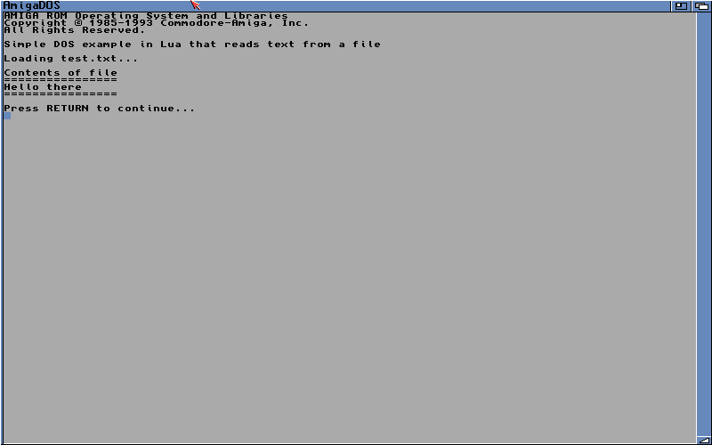
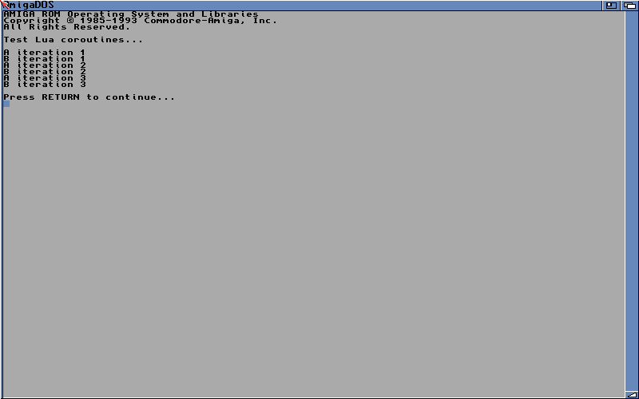
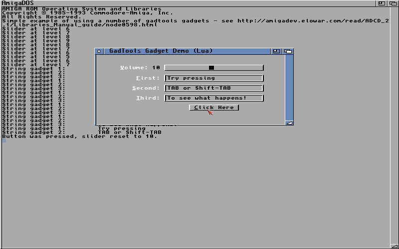
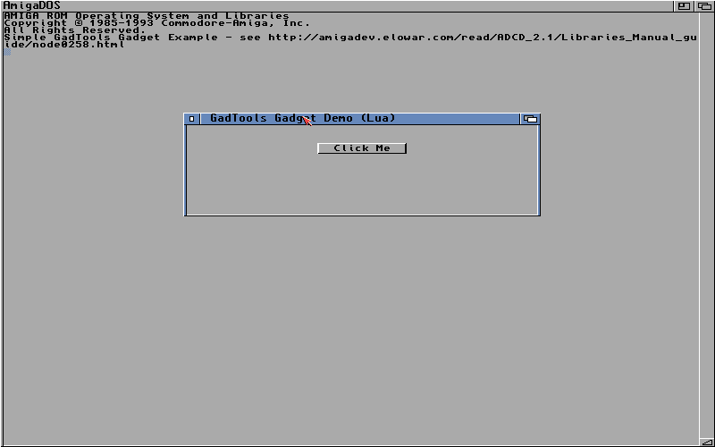
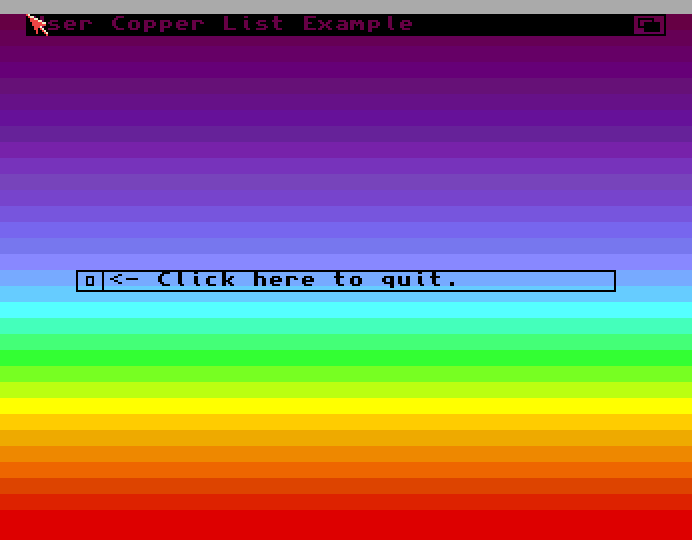
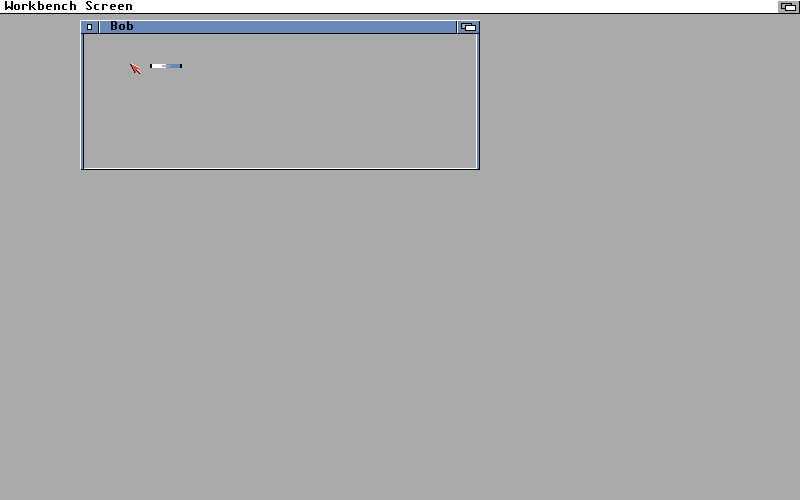
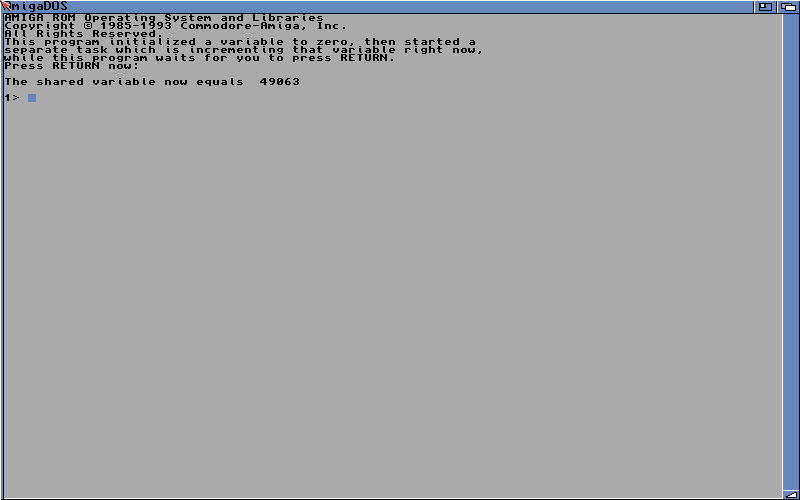

This is AmigaDaLua based on Lua 5.4.8.

This fork has (some) Amiga NDK bindings such that
you can write Amiga programs in Lua.

NOTE: This is incomplete and not really usable for
anything for the time being.

For installation instructions, license details, and
further information about Lua, see doc/readme.html.

# AmigaDaLua - Lua with Amiga NDK Bindings

### Stack

AmigaDaLua and Lua in general uses a large stack. Set the stack on your shell before running.

```bash
CLI>stack 256000
```

## Bindings

There are two ways to access the Amiga NDK bindings in AmigaDaLua

1. Use `lua_big` which has all configured Amiga NDK bindings available
2. Use `lua` and dynamically load bindings via lua

```lua
LoadBindings("exec")
```

When you load a binding, the corrensponding `.bindings` file must be available. For example `exec.bindings`

Currently available bindings libraries:

```lua
LoadBindings("dos")
LoadBindings("exec")
LoadBindings("graphics")
LoadBindings("intuition")
```

### Which bindings are included ?

To get an idea of which symbols should have bindings see:

* src/lua_all.py 
* src/lua_dos.py 
* src/lua_exec.py 
* src/lua_graphics.py 
* src/lua_intuition.py 

They have been automatically generated so symbols for these libraries may have been missed. More comprehensive binding coverage and documentation will follow.

The bindings code is automatically generated and quite memory heavy

## Tags

Functions that take a variable number of tags such as `OpenWindowTags` on the Amiga would require a TAG_END tag to indicate the end of the tag arguments. On AmigaDaLua this is not currently required/supported.

```lua
mywin = OpenWindowTags(nil,
                       WA_Title,         "GadTools Gadget Demo (Lua)",
                       WA_Gadgets,       GetPtr(glist),
                       WA_AutoAdjust,    true,
                       WA_Width,         400,
                       WA_MinWidth,      50,
                       WA_InnerHeight,   140,
                       WA_MinHeight,     50,
                       WA_DragBar,       true,
                       WA_DepthGadget,   true,
                       WA_Activate,      true,
                       WA_CloseGadget,   true,
                       WA_SizeGadget,    true,
                       WA_SimpleRefresh, true,
                       WA_IDCMP, IDCMP_CLOSEWINDOW | IDCMP_REFRESHWINDOW | IDCMP_VANILLAKEY | SLIDERIDCMP | STRINGIDCMP | BUTTONIDCMP,
                       WA_PubScreen, GetPtr(mysc))
```

Creating a TagList requires Lua utility code (found in util.lua). Again, no need for TAG_END.

```lua
local Util = require("util")
local tags = Util.TagList {
               WA_Title = "GadTools Gadget Demo (Lua)",
               WA_Gadgets = GetPtr(gad),
               WA_Width = 400,
               WA_InnerHeight = 100,
               WA_AutoAdjust = true,
               WA_DragBar = true,
               WA_DepthGadget = true,
               WA_CloseGadget = true,
               WA_Activate = true,
               WA_PubScreen = GetPtr(mysc),
               WA_IDCMP = IDCMP_CLOSEWINDOW|IDCMP_REFRESHWINDOW|BUTTONIDCMP,
            }

local mywin = OpenWindowTagList(nil, tags)
```

## Creating instances of structures

To create a variable of TextAttr type you can create it inline as follows:

```lua
local Topaz80 = TextAttr {
   ta_Name = "topaz.font",
   ta_YSize = 8,
   ta_Style = 0,
   ta_Flags = 0,   
}
```

This can then be used by any type that expects a TextAttr, eg:

```lua
local ng = NewGadget {
    ng_TextAttr   = Topaz80,
    ng_VisualInfo = vi,
    ng_LeftEdge   = 150,
    ng_TopEdge    = 20 + mysc.WBorTop + (mysc.Font.ta_YSize + 1),
    ng_Width      = 100,
    ng_Height     = 12,
    ng_GadgetText = "Click Me",
    ng_GadgetID   = MYGAD_BUTTON,
    ng_Flags      = 0,   
 }
```

If you are assigning a typed variable to something untyped (like a TAG or void *) you must use the `GetPtr` function to convert the type to a pointer.

```lua
local screen = OpenScreenTags(nil,
                              SA_Overscan, OSCAN_STANDARD,
		                      SA_Title, "User Copper List Example",
			                  SA_Font, GetPtr(Topaz80))
```

## Creating buffers

### Use CreateArrayXXXX

AmigaDaLua has some special types for creating arrays of words. Note: these arrays are indexed as Lua arrays (1 based index)

```lua
local spectrum = CreateArrayUWORD {
    0x0604, 0x0605, 0x0606, 0x0607, 0x0617, 0x0618, 0x0619,
    0x0629, 0x072a, 0x073b, 0x074b, 0x074c, 0x075d, 0x076e,
    0x077e, 0x088f, 0x07af, 0x06cf, 0x05ff, 0x04fb, 0x04f7,
    0x03f3, 0x07f2, 0x0bf1, 0x0ff0, 0x0fc0, 0x0ea0, 0x0e80,
    0x0e60, 0x0d40, 0x0d20, 0x0d00
}
```

If you need to create the array in chip ram, use `CreateChipArrayUWORD`

### Use AllocMem

Amiga examples might use a static buffer to store data, the easiest way to do this in AmigaDaLua is to use AllocMem

```C
/* C example */
char buffer[1024];
```

```lua
-- Easiest to do this with AllocMem in AmigaDaLua
local buffer = AllocMem(1024, MEMF_PUBLIC)
```

## Getting the address of an array element

Use the special `:ptr()` array extension to get the address of an array element. Note: array indexes are 1 indexed.

```lua
 CMOVE(uCopList, custom.color:ptr(1), spectrum[i])
```

## Be careful with false, nil and 0

Many AmigaOS functions will return `0`. It Lua this is not `== false` - Safest to use Amiga defined return value variables.

Structure fields of real types or AmigaOS functions that return real types will be equal to `nil` when there is no value.

## GadgetLists

### NewGadgetList

NewGadgetList will create the equivalent of a pointer-to-pointer (`GadgetPtr`) for use with `CreateContext()`. Once the context is created you can use the returned gadget as a pointer to the gadget list.

```lua
   local gad = CreateContext(NewGadgetList())
   local glist = gad -- Lua slightly different way of keeping track of the glist
```	 

## Examples

A selection of examples mainly taken from the Amiga RKM. Many examples have the original C code as a reference.

### [DOS Simple](examples/dos/dos_simple.lua)

Reads a file uses Open/Read etc.



### [Lua Coroutine](examples/lua/coroutine.lua)



### [Gadtools Gadgets](examples/gadtools/gadtoolsgadgets.lua)



### [TagLists](examples/gadtools/simplegtgadget-taglists.lua)



### [User Copper](examples/graphics/usercopper.lua)



### [Graphics Bob](examples/graphics/bob.lua)



### [Exec CreateTask](examples/exec/simpletask.lua)



